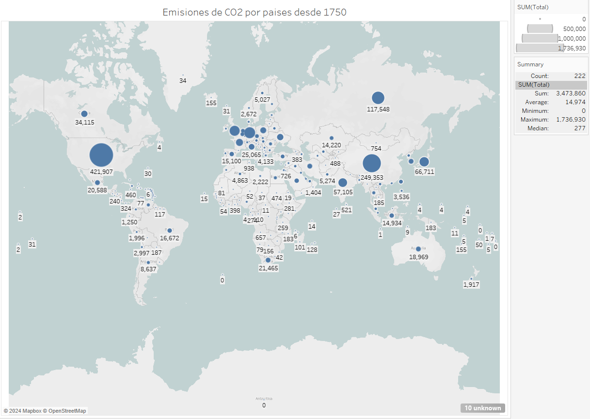

```{r setup, include=FALSE}
knitr::opts_chunk$set(echo = TRUE)
```

```{r echo=FALSE, message=FALSE, warning=FALSE}

```

# Mapa de total de contaminación CO2 por paises desde 1750



USA es el país más contaminate desde la era industrial, sin embargo, como veremos en [Histograma](../histograma/Carlos_TORO_Visualizacion_histograma.html "histograma"), esta tendencia está cambiando debido al desarrollo de China.

Por otro lado, hay que añadir que la suma los paises europeos, es comparable a los niveles de contaminación de los paises más contaminantes.

[Volver a la página principal](../index.html "Volver a la página principal")
